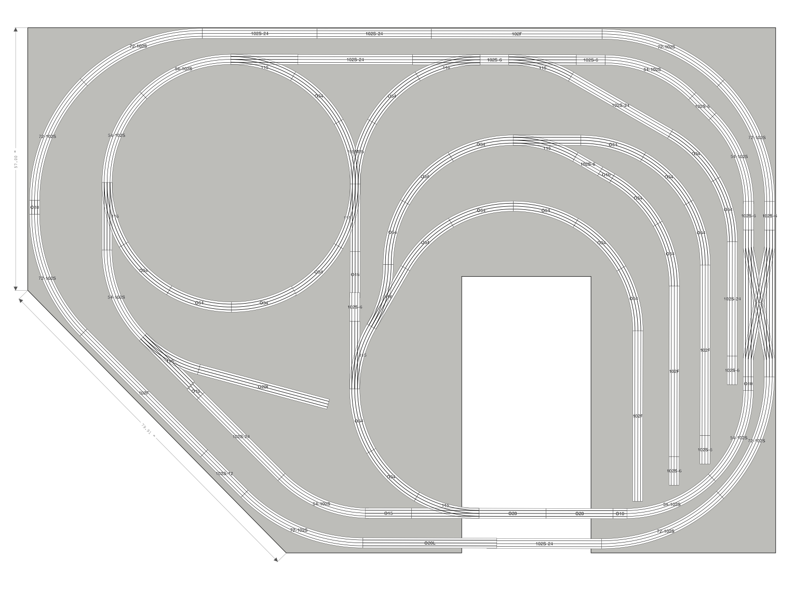

# GarGraves Joseph Justus Custom Layout

This is a custom 14' x 10' layout design that uses GarGraves 0 gauge Stainless Phantom Track and Ross Custom Switches. There is some overlap within the straight track that would need to be custom cut and Ross Custom Switches that can be substituted and cut with GarGraves. Outside loops is a requested 072 curve and the inside loop curves are a requested 054 curve.

## Parts List

| Number | Product Number | Description                                              | Manufacturer                   | Price   | Count | Total   |
| ------ | -------------- | -------------------------------------------------------- | ------------------------------ | ------- | ----- | ------- |
| 001    | 102F           | 37" flex track w/ stainless rails                        | GarGraves Trackage Corporation | $5.85   | 5     | $29.25  |
| 002    | 102S-12        | 12.4" Straight Rigid w/ Stainless Rails and Plastic Ties | GarGraves Trackage Corporation | $3.45   | 1     | $3.45   |
| 003    | 102S-24        | 24.8" Straight Rigid w/ Stainless Rails and Plastic Ties | GarGraves Trackage Corporation | $6.25   | 7     | $43.75  |
| 004    | 102S-6         | 6.2" Straight Rigid w/ Stainless Rails and Plastic Ties  | GarGraves Trackage Corporation | $2.05   | 10    | $20.50  |
| 005    | 115            | O54 Right-hand Switch                                    | Ross Custom Switches           | $52.95  | 6     | $317.70 |
| 006    | 116            | O54 Left-hand Switch                                     | Ross Custom Switches           | $52.95  | 4     | $211.80 |
| 007    | 155M25         | O54 Wye Switch with DZ2500 Switch Machine                | Ross Custom Switches           | $84.95  | 1     | $84.95  |
| 008    | 175            | Double Crossover                                         | Ross Custom Switches           | $329.95 | 1     | $329.95 |
| 009    | 54-102S        | 54" Curve w/ Stainless Rails and Plastic Ties            | GarGraves Trackage Corporation | $8.10   | 8     | $64.80  |
| 010    | 72-102S        | 72" Curve w/ Stainless Rails and Plastic Ties            | GarGraves Trackage Corporation | $9.10   | 8     | $72.80  |
| 011    | O10            | 3" Straight Track                                        | Ross Custom Switches           | $3.95   | 5     | $19.75  |
| 012    | O15            | 10" Straight Track                                       | Ross Custom Switches           | $4.95   | 2     | $9.90   |
| 013    | O20            | 14.5" Straight Track                                     | Ross Custom Switches           | $5.49   | 2     | $10.98  |
| 014    | O20L           | 29" Straight Track                                       | Ross Custom Switches           | $10.95  | 2     | $21.90  |
| 015    | O54            | 27" Radius, 54" Diameter Curve Track                     | Ross Custom Switches           | $5.95   | 23    | $136.85 |

Parts List Total: **$1378.33**
